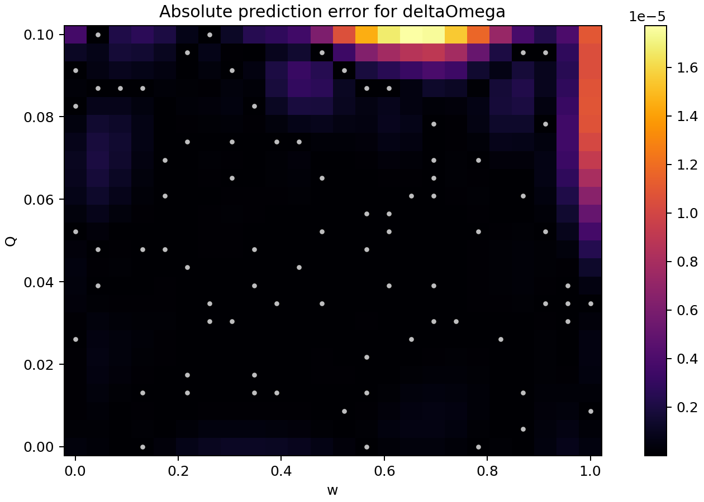
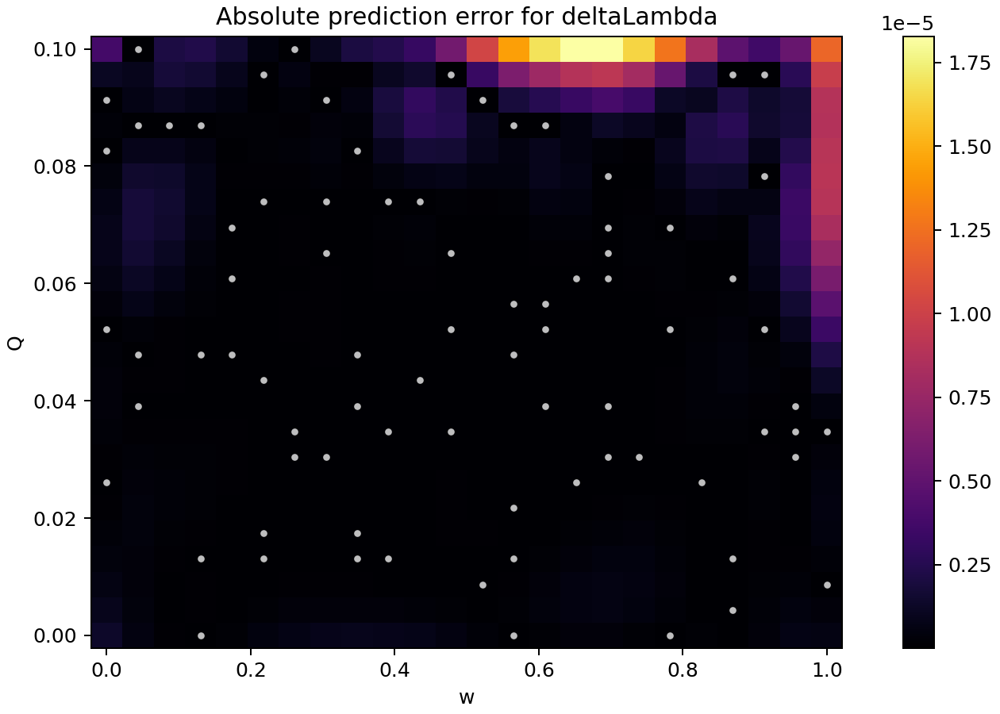
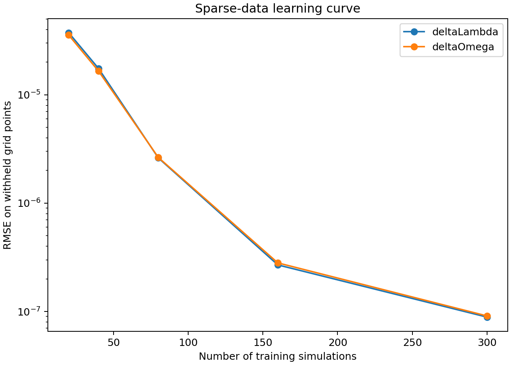
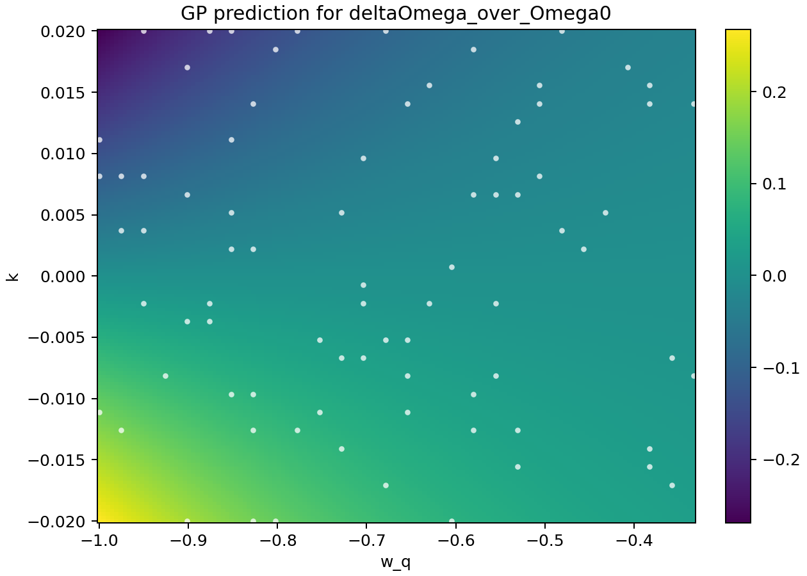
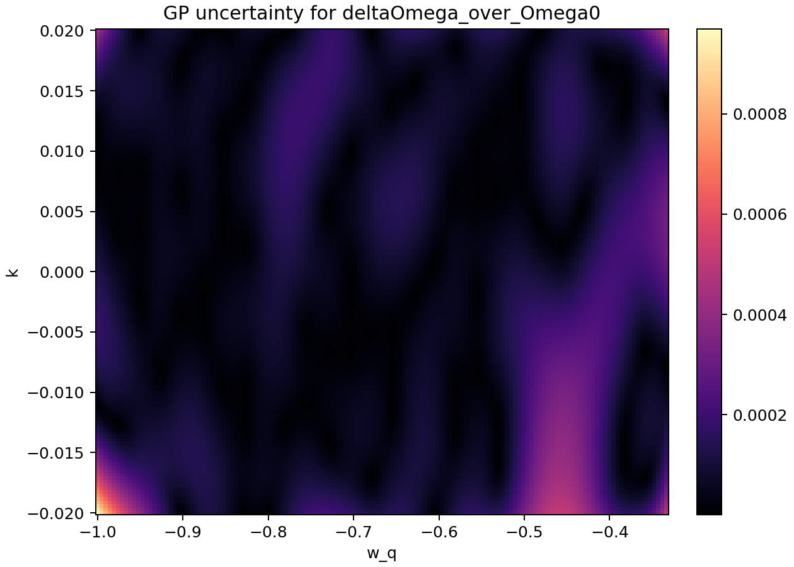
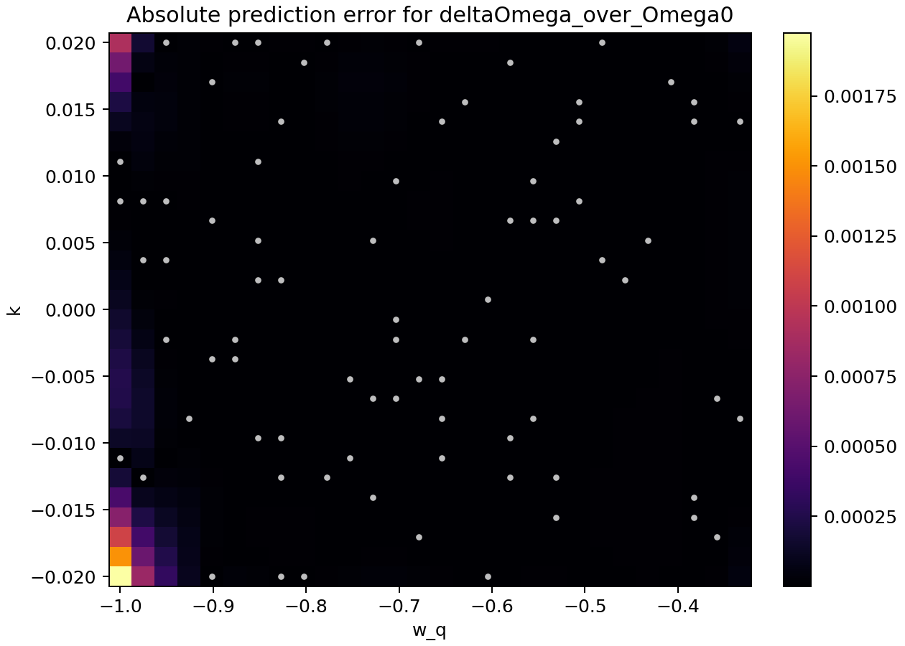
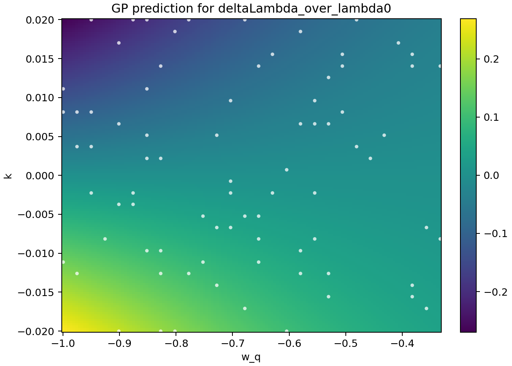
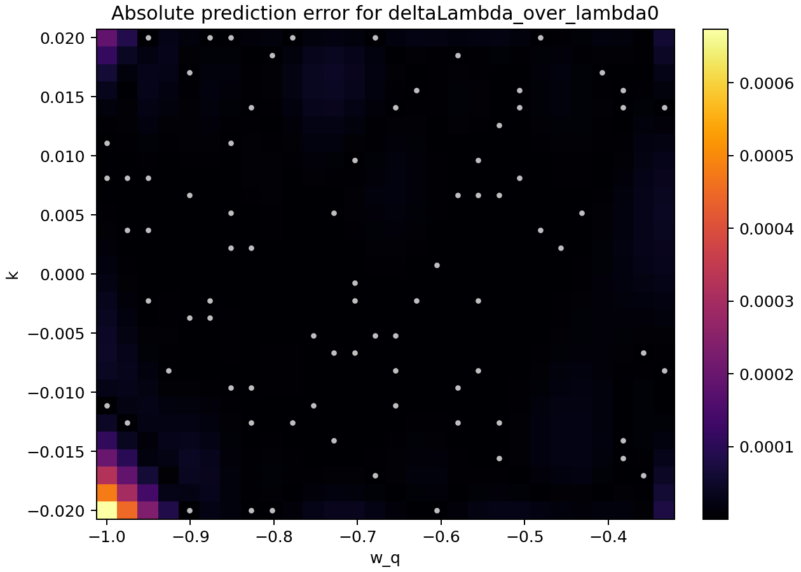
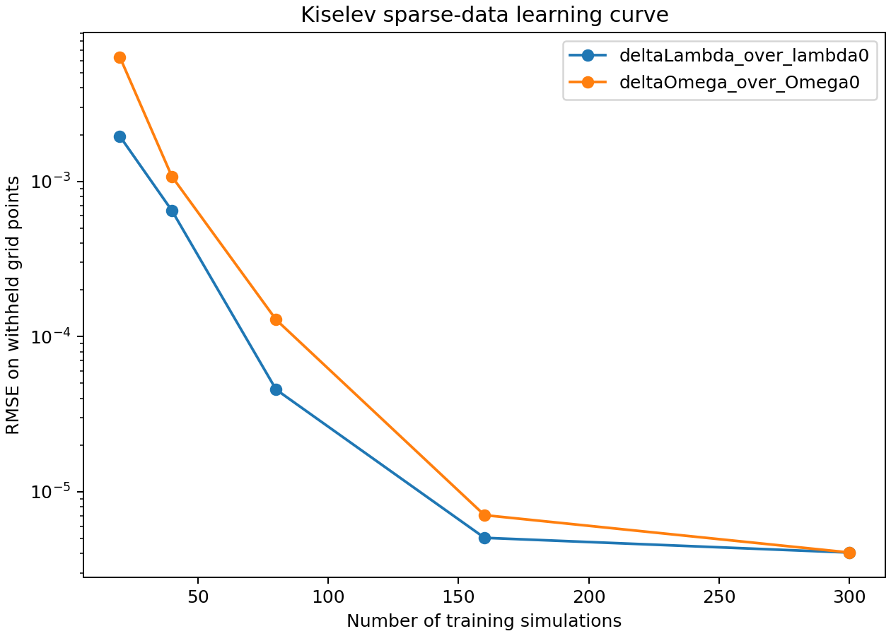

# QNM Gaussian Process Surrogate

Gaussian Process surrogate modelling for fast parameter search in black-hole
ringdown shifts.

This project implements a sparse-data, two-output version of the map


The code computes photon-sphere observables from a small fluid-inspired
perturbation of Schwarzschild, trains two uncertainty-aware Gaussian Processes
models on a limited number of simulated points, compared against the baseline
regressors, and then uses the learned surrogate to infer the physical
parameters that reproduce a target complex quasinormal-mode frequency.

## Motivation

Ringdown observables can be expensive to evaluate if every point in parameter
space requires solving the full physical model. A surrogate model gives a fast
approximation while also estimating where it is uncertain.

Here, the input parameters are:

- $w_\theta$: equation-of-state/profile parameter.
- `Q`: perturbation strength.

The learned targets are:

- $\delta\Omega$: shift in photon-sphere orbital frequency.
- $\delta\lambda$: shift in the Lyapunov exponent of the unstable null orbit.

Those are converted into the eikonal QNM estimate

$$\omega_{\rm QNM} = \ell\,\Omega_c - i\left(n+\frac{1}{2}\right)\lambda_c .$$

where $\Omega_c$ is the circular null-orbit frequency, $\lambda_c$ is the
Lyapunov exponent, $\ell$ is the angular mode, and $n$ is the overtone number.
The current run uses $\ell=4$ and $n=0$, closer to the large- $\ell$ regime
where the eikonal approximation is expected to be most appropriate.

## What the Script Does

1. Defines a perturbative black-hole metric model.
2. Solves the photon-sphere condition:

   $rA^{\prime}(r) - 2A(r) = 0$.

4. Computes `Omega_c`, `lambda_c`, and the complex eikonal QNM frequency.
5. Generates a grid dataset over ($w_\theta$, Q).
6. Trains two Gaussian Process regressors on a sparse subset of the grid:

- ($w_\theta$, Q) → δΩ
- ($w_\theta$, Q) → δλ
  
8. Tests on withheld grid points.
9. Compares the GP against linear, polynomial, and random-forest baselines.
10. Produces prediction, uncertainty, and actual-error maps.
11. Builds a learning curve versus the number of simulations.
12. Performs inverse parameter search from a target QNM frequency.

## Repository Layout

```text
.
|-- qnm_surrogate.py          # Main physics + ML pipeline
|-- paper_connected_kiselev_gp.py # Paper-connected Kiselev analytic model
|-- requirements.txt          # Python dependencies
|-- CITATION.cff              # Citation metadata for GitHub
|-- LICENSE                   # MIT license
|-- outputs/
|   |-- qnm_dataset.csv       # Generated training/evaluation grid
|   |-- gp_metrics.csv        # Test-set metrics
|   |-- baseline_metrics.csv  # GP versus baseline regressors
|   |-- learning_curve.csv    # Error versus number of training simulations
|   |-- parameter_search.csv  # Inverse QNM parameter recovery result
|   `-- *.png                 # Prediction and uncertainty maps
`-- README.md
```

## Quick Start

Create an environment and install dependencies:

```powershell
python -m venv .venv
.\.venv\Scripts\Activate.ps1
pip install -r requirements.txt
```

Run the full pipeline:

```powershell
python qnm_surrogate.py
```

The script regenerates the dataset, trains sparse-data GP models, and compares
baselines, runs parameter recovery, and writes all outputs to `outputs/`.

## Paper-Connected Kiselev Model

The script `paper_connected_kiselev_gp.py` replaces the toy metric with the
static Kiselev form used in the paper:

$$
f(r)=1-\frac{2M}{r}-\frac{k}{r^{1+3w_q}} .
$$

The implementation uses

$$
M=1,\qquad r_0=3M,
$$

and samples a grid in the physical parameters $(w_q,k)$ with small $|k|$.
The analytic QNM ingredient shifts are

$$
\Omega_\star
=\Omega_0\left[
1-\frac{3k}{2(3M)^{1+3w_q}}
\right],
$$

and

$$
\lambda_\star
=\lambda_0\left[
1+\frac{\left(3w_q(1+w_q)-2\right)k}
{4\,3^{3w_q}M^{1+3w_q}}
\right].
$$

The two surrogate targets are the relative shifts

$$
\frac{\delta\Omega}{\Omega_0}
=\frac{\Omega_\star}{\Omega_0}-1,
\qquad
\frac{\delta\lambda}{\lambda_0}
=\frac{\lambda_\star}{\lambda_0}-1.
$$

Run the paper-connected version with:

```powershell
python paper_connected_kiselev_gp.py
```

It writes its results to `outputs/kiselev/`, including sparse GP metrics,
baseline comparisons, uncertainty maps, error maps, a learning curve, and an
inverse parameter-search example.

For the current Kiselev run, the GP is trained on 80 simulations and tested on
704 withheld grid points:

| Target | RMSE | MAE | R2 | Mean GP sigma |
| --- | ---: | ---: | ---: | ---: |
| $\delta\Omega/\Omega_0$ | `1.28e-04` | `2.64e-05` | `0.999997` | `1.09e-04` |
| $\delta\lambda/\lambda_0$ | `4.55e-05` | `1.44e-05` | `0.9999997` | `4.90e-05` |

The inverse search target was $(w_q,k)=(-0.72,0.012)$ and the surrogate
recovered approximately $(w_q,k)=(-0.7189,0.01204)$.

## Example Results

The current main run trains on only 80 simulations and tests on the remaining
496 grid points. The QNM reconstruction uses $\ell=4$ and $n=0$.

| Target | RMSE | MAE | R2 | Mean GP sigma |
| --- | ---: | ---: | ---: | ---: |
| `deltaOmega` | `2.64e-06` | `1.01e-06` | `0.9999998743` | `2.34e-06` |
| `deltaLambda` | `2.61e-06` | `9.91e-07` | `0.9999998448` | `2.25e-06` |

Baseline comparison with the same 80 training simulations:

| Target | Model | RMSE | R2 |
| --- | --- | ---: | ---: |
| `deltaOmega` | Gaussian Process | `2.64e-06` | `0.9999998743` |
| `deltaOmega` | Linear regression | `1.01e-03` | `0.981675` |
| `deltaOmega` | Polynomial degree 3 | `4.60e-05` | `0.999962` |
| `deltaOmega` | Random forest | `8.82e-04` | `0.985951` |
| `deltaLambda` | Gaussian Process | `2.61e-06` | `0.9999998448` |
| `deltaLambda` | Linear regression | `1.34e-03` | `0.959115` |
| `deltaLambda` | Polynomial degree 3 | `4.35e-05` | `0.999957` |
| `deltaLambda` | Random forest | `1.03e-03` | `0.975866` |

Inverse search example:

| Quantity | Value |
| --- | ---: |
| Target $w_\theta$ | `0.630000` |
| Target `Q` | `0.072000` |
| Recovered $w_\theta$ | `0.630000` |
| Recovered `Q` | `0.072000` |
| Target `Re(omega)` | `0.840640` |
| Target `Im(omega)` | `-0.104041` |

The target is off-grid relative to the sparse training subset, so this is a
surrogate-based inverse search rather than a lookup.

## Figures

### GP Prediction for `deltaOmega`


Caption: Predicted $\delta\Omega(w,Q)$ from the Gaussian Process surrogate.
White points mark the sparse training simulations used by the model.

### GP Uncertainty for `deltaOmega`


Caption: GP posterior standard deviation for $\delta\Omega$. Larger values
indicate regions where the surrogate is less certain.

### Absolute Error for `deltaOmega`



Caption: Absolute error
$|\delta\Omega_{\rm true}-\delta\Omega_{\rm GP}|$ evaluated on the full grid.
This tests whether uncertainty is connected to actual prediction error.

### GP Prediction for `deltaLambda`


Caption: Predicted $\delta\lambda(w,Q)$ from the second Gaussian Process
surrogate, again trained only on the sparse subset.

### GP Uncertainty for `deltaLambda`


Caption: GP posterior standard deviation for $\delta\lambda$, showing where the Lyapunov-exponent surrogate has higher uncertainty.

### Absolute Error for `deltaLambda`



Caption: Absolute error
$|\delta\lambda_{\rm true}-\delta\lambda_{\rm GP}|$ on the full grid.

### Learning Curve



Caption: Test RMSE as the number of training simulations increases. This is the main evidence that the surrogate becomes accurate with far fewer evaluations than the full grid.

## Kiselev Figures

### Kiselev GP Prediction for $\delta\Omega/\Omega_0$



Caption: GP prediction for the relative orbital-frequency shift
$\delta\Omega/\Omega_0$ over the Kiselev parameter space $(w_q,k)$. White
points are the sparse training simulations.

### Kiselev GP Uncertainty for $\delta\Omega/\Omega_0$



Caption: Posterior GP standard deviation for $\delta\Omega/\Omega_0$. This is
the model's uncertainty estimate, not an additional physical observable.

### Kiselev Absolute Error for $\delta\Omega/\Omega_0$



Caption: Absolute error
$|(\delta\Omega/\Omega_0)_{\rm true}-(\delta\Omega/\Omega_0)_{\rm GP}|$ on the
full evaluation grid.

### Kiselev GP Prediction for $\delta\lambda/\lambda_0$



Caption: GP prediction for the relative Lyapunov-exponent shift
$\delta\lambda/\lambda_0$ over $(w_q,k)$.

### Kiselev GP Uncertainty for $\delta\lambda/\lambda_0$


Caption: Posterior GP standard deviation for $\delta\lambda/\lambda_0$.

### Kiselev Absolute Error for $\delta\lambda/\lambda_0$



Caption: Absolute error
$|(\delta\lambda/\lambda_0)_{\rm true}-(\delta\lambda/\lambda_0)_{\rm GP}|$ on
the full evaluation grid.

### Kiselev Learning Curve



Caption: Test RMSE versus the number of Kiselev training simulations. The
curve checks whether the GP surrogate improves systematically as more
paper-connected forward-model evaluations are added.

## Scientific Status

This is a research-prototype pipeline. The machine-learning and QNM workflow is
real, but the default metric perturbation in `metric_A` is intentionally a toy
model. It is designed to be easy to replace with the exact perturbative metric
functions from the paper or from a symbolic/numerical solver.

The current dataset is synthetic/model-generated. The goal is to demonstrate
the surrogate-modelling workflow before replacing the toy equations with more
expensive numerical simulations.

The important reusable structure is:

```text
metric model -> photon sphere -> Omega/lambda -> QNM -> GP surrogate -> inverse search
```

## How to Connect It to the Paper

Replace the implementation of `metric_A` and, if needed, `metric_B` in
`qnm_surrogate.py` with the metric functions from the theoretical model. The
rest of the pipeline can remain almost unchanged:

1. solve the circular null-orbit condition;
2. compute $\Omega_c$;
3. compute $\lambda_c$;
4. train one GP for $\delta\Omega$;
5. train one GP for $\delta\lambda$;
6. infer $(w,Q)$ from a target complex QNM.

## Next Improvements

- Replace the toy perturbation with the exact metric from the paper.
- Add active learning: start with a small training set, then sample where GP
  uncertainty is largest.
- Add cross-validation across different grid resolutions.
- Save trained models with `joblib`.
- Add a notebook version for presentation and plots.

## License

MIT License. See `LICENSE`.
