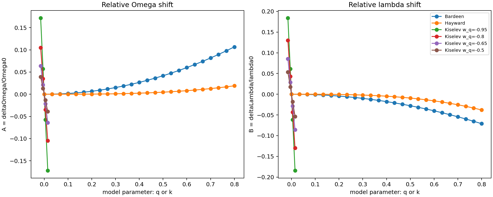
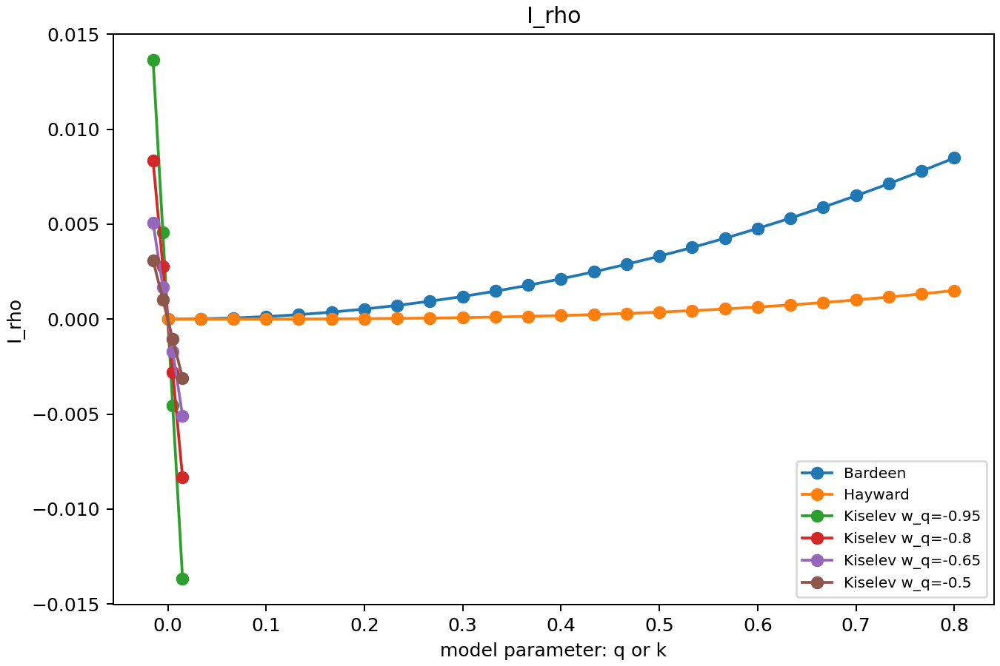
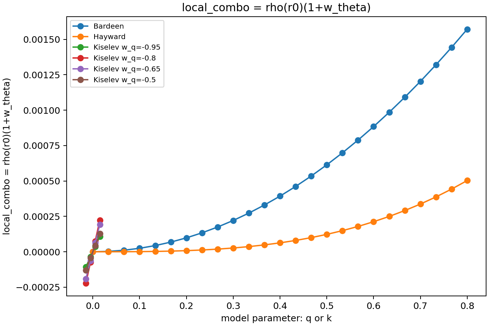
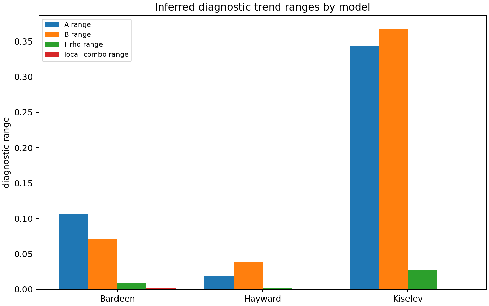

# Kiselev QNM Gaussian Process Surrogate

This repository implements a paper-connected Gaussian Process surrogate for
QNM-related observables in the static Kiselev black-hole model.

The physical forward model is based on the Kiselev metric

```text
f(r) = 1 - 2M/r - k/r^(1 + 3 w_q)
```

and on the analytic eikonal QNM shifts derived in the paper. The surrogate
learns the maps:

- `(w_q, k) -> deltaOmega/Omega0`
- `(w_q, k) -> deltaLambda/lambda0`

These quantities are then used to reconstruct the eikonal QNM estimate:

```text
omega_QNM = ell * Omega - i * (n + 1/2) * lambda
```

The current implementation uses `M = 1`, `r0 = 3M`, `ell = 4`, and `n = 0`.

## Physical Model

The main script is `kiselev_gp_surrogate.py`. It uses the static Kiselev metric
function

```text
f(r) = 1 - 2M/r - k/r^(1 + 3 w_q)
```

with small `|k|`. The paper-connected analytic formulas used for the QNM
ingredients are:

```text
Omega_star =
Omega0 * (1 - 3*k/(2*(3M)^(1 + 3*w_q)))
```

and

```text
lambda_star =
lambda0 * (1 + ([3*w_q*(1+w_q) - 2] * k)
              / (4 * 3^(3*w_q) * M^(1 + 3*w_q)))
```

The surrogate targets are relative shifts:

```text
deltaOmega/Omega0  = Omega_star/Omega0 - 1
deltaLambda/lambda0 = lambda_star/lambda0 - 1
```

## What the Main Script Does

1. Generates a grid over `(w_q, k)`.
2. Computes `deltaOmega/Omega0` and `deltaLambda/lambda0` using the analytic
   Kiselev formulas.
3. Trains two sparse-data Gaussian Process models:
   - `(w_q, k) -> deltaOmega/Omega0`
   - `(w_q, k) -> deltaLambda/lambda0`
4. Tests the GP models on withheld grid points.
5. Compares the GP against baseline regressors:
   - linear regression
   - polynomial regression
   - random forest
6. Produces prediction maps, uncertainty maps, error maps, and a learning curve.
7. Performs inverse parameter search from a target complex QNM frequency.

## Repository Layout

```text
.
|-- kiselev_gp_surrogate.py        # Main paper-connected Kiselev GP surrogate
|-- inverse_qnm_matter_diagnostics.py # Inverse QNM matter diagnostics
|-- legacy/
|   `-- toy_metric_surrogate.py    # Old toy demonstration, not main result
|-- requirements.txt
|-- CITATION.cff
|-- LICENSE
|-- outputs/
|   |-- kiselev/
|   |   |-- kiselev_qnm_dataset.csv
|   |   |-- gp_metrics.csv
|   |   |-- baseline_metrics.csv
|   |   |-- learning_curve.csv
|   |   |-- parameter_search.csv
|   |   `-- *.png
|   `-- inverse_diagnostics/
|       |-- inverse_diagnostics.csv
|       |-- profile_reconstruction.csv
|       `-- *.png
`-- README.md
```

## Quick Start

Create an environment and install dependencies:

```powershell
python -m venv .venv
.\.venv\Scripts\Activate.ps1
pip install -r requirements.txt
```

Run the main paper-connected pipeline:

```powershell
python kiselev_gp_surrogate.py
```

The script regenerates all Kiselev outputs in:

```text
outputs/kiselev/
```

Run the inverse diagnostic module with:

```powershell
python inverse_qnm_matter_diagnostics.py
```

This writes diagnostic outputs to:

```text
outputs/inverse_diagnostics/
```

## Current Results

The current run trains on 80 Kiselev forward-model evaluations and tests on
704 withheld grid points.

| Target | RMSE | MAE | R2 | Mean GP sigma |
| --- | ---: | ---: | ---: | ---: |
| `deltaOmega/Omega0` | `1.28e-04` | `2.64e-05` | `0.999997` | `1.09e-04` |
| `deltaLambda/lambda0` | `4.55e-05` | `1.44e-05` | `0.9999997` | `4.90e-05` |

Baseline comparison with the same 80 training evaluations:

| Target | Model | RMSE | R2 |
| --- | --- | ---: | ---: |
| `deltaOmega/Omega0` | Gaussian Process | `1.28e-04` | `0.999997` |
| `deltaOmega/Omega0` | Linear regression | `4.28e-02` | `0.700403` |
| `deltaOmega/Omega0` | Polynomial degree 3 | `2.33e-03` | `0.999116` |
| `deltaOmega/Omega0` | Random forest | `1.80e-02` | `0.947297` |
| `deltaLambda/lambda0` | Gaussian Process | `4.55e-05` | `0.9999997` |
| `deltaLambda/lambda0` | Linear regression | `4.31e-02` | `0.770802` |
| `deltaLambda/lambda0` | Polynomial degree 3 | `4.46e-04` | `0.999975` |
| `deltaLambda/lambda0` | Random forest | `1.88e-02` | `0.956340` |

Inverse parameter search example:

| Quantity | Value |
| --- | ---: |
| Target `w_q` | `-0.720000` |
| Target `k` | `0.012000` |
| Recovered `w_q` | `-0.718943` |
| Recovered `k` | `0.012044` |
| Target `Re(omega)` | `0.720243` |
| Target `Im(omega)` | `-0.088157` |

## Figures

### GP Prediction for `deltaOmega/Omega0`


Caption: GP prediction for the relative orbital-frequency shift
`deltaOmega/Omega0` over the Kiselev parameter space `(w_q, k)`. White points
are the sparse training evaluations.

### GP Uncertainty for `deltaOmega/Omega0`


Caption: Posterior GP standard deviation for `deltaOmega/Omega0`. This is the
model uncertainty estimate.

### Absolute Error for `deltaOmega/Omega0`


Caption: Absolute prediction error for `deltaOmega/Omega0` on the full
evaluation grid.

### GP Prediction for `deltaLambda/lambda0`


Caption: GP prediction for the relative Lyapunov-exponent shift
`deltaLambda/lambda0` over `(w_q, k)`.

### GP Uncertainty for `deltaLambda/lambda0`


Caption: Posterior GP standard deviation for `deltaLambda/lambda0`.

### Absolute Error for `deltaLambda/lambda0`


Caption: Absolute prediction error for `deltaLambda/lambda0` on the full
evaluation grid.

### Learning Curve


Caption: Test RMSE versus number of Kiselev training evaluations. This checks
how rapidly the GP surrogate improves as more forward-model evaluations are
added.

## Inverse QNM Matter Diagnostics

The script `inverse_qnm_matter_diagnostics.py` adds a physically meaningful
inverse-analysis layer. It starts from a target complex eikonal QNM frequency,

```text
omega_QNM = ell * Omega - i * (n + 1/2) * lambda
```

and extracts the two real observables:

```text
Omega  = Re(omega_QNM) / ell
lambda = -Im(omega_QNM) / (n + 1/2)
```

Using the Schwarzschild reference values

```text
Omega0 = 1/(3 sqrt(3) M)
lambda0 = 1/(3 sqrt(3) M)
r0 = 3M
```

the code computes:

```text
A = deltaOmega/Omega0  = Omega/Omega0 - 1
B = deltaLambda/lambda0 = lambda/lambda0 - 1
```

In the static anisotropic-fluid approximation, these determine the diagnostic
combinations:

```text
delta_f(r0) = (2/3) * A
I_rho       = integral_{r0}^{infinity} rho(s) s^2 ds
            = r0 * A / (12*pi)
local_combo = rho(r0) * (1 + w_theta)
            = (A - B) / (4*pi*r0^2)
```

These are matter diagnostics, not a unique matter reconstruction. One complex
QNM gives only two real numbers, `Omega` and `lambda`. Therefore it cannot
uniquely determine the full density profile `rho(r)` or `w_theta` separately
without an additional assumption.

The module validates the inverse formulas using:

- Kiselev analytic QNM shifts from `kiselev_gp_surrogate.py`
- Bardeen first-order shifts:
  - `deltaOmega/Omega0 = q^2/(6 M^2)`
  - `deltaLambda/lambda0 = -q^2/(9 M^2)`
- Hayward first-order shifts:
  - `deltaOmega/Omega0 = q^3/(27 M^3)`
  - `deltaLambda/lambda0 = -2 q^3/(27 M^3)`

It saves:

```text
outputs/inverse_diagnostics/inverse_diagnostics.csv
outputs/inverse_diagnostics/profile_reconstruction.csv
```

and diagnostic plots comparing the inferred trends across Kiselev, Bardeen,
and Hayward examples.

### Conditional Profile Reconstruction

The script also includes an optional parametric reconstruction. If one assumes

```text
rho(r) = rho0 * exp(-(r-r0)/L)
```

with fixed `L`, then `I_rho` can be used to estimate `rho0`, and
`local_combo = rho(r0)(1+w_theta)` can be used to estimate `w_theta`.

This reconstruction is conditional on the assumed density profile and fixed
length scale `L`. It should not be interpreted as a model-independent
reconstruction of the matter sector.

### Inverse Diagnostic Figures



Caption: Relative shifts `A = deltaOmega/Omega0` and
`B = deltaLambda/lambda0` versus the model parameter. Bardeen and Hayward use
`q`; Kiselev uses `k` at several fixed `w_q` values.



Caption: Inferred integrated density diagnostic `I_rho` versus the model
parameter for Kiselev, Bardeen, and Hayward examples.



Caption: Inferred local combination `rho(r0)(1+w_theta)` versus the model
parameter.



Caption: Comparison of inferred diagnostic trend ranges across the validation
models.

## Scientific Status

The main Kiselev script is paper-connected because it uses the analytic Kiselev
QNM-shift formulas. The current forward model is analytic and cheap, so this is
a validation/prototype of the surrogate workflow. The inverse diagnostic module
adds a physical use beyond surrogate interpolation by translating QNM shifts
into matter diagnostic combinations.

The next step is to replace the analytic formulas with more expensive numerical
forward models, such as rotating hairy black-hole formulas or numerical
geodesic/QNM calculations.

The legacy toy script is kept only as an early demonstration and should not be
interpreted as a physical result.

## Legacy Toy Demo

The repository also contains `legacy/toy_metric_surrogate.py`, an earlier toy
demonstration using an artificial metric perturbation. It is useful only for
testing the ML pipeline structure and is not the paper-connected model.

## License

MIT License. See `LICENSE`.
