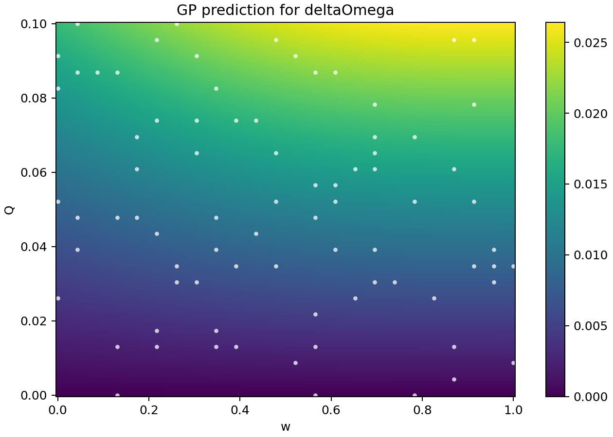
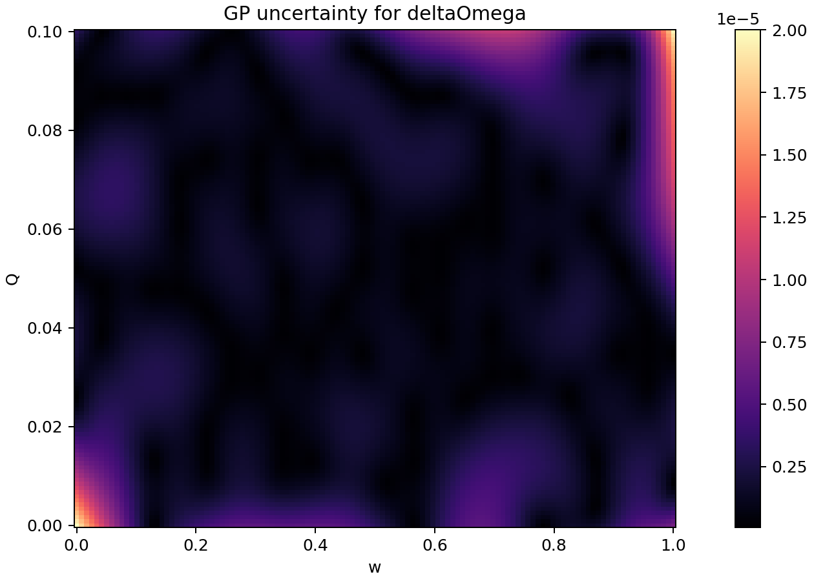
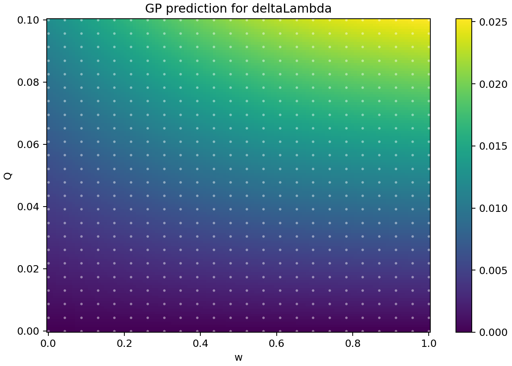
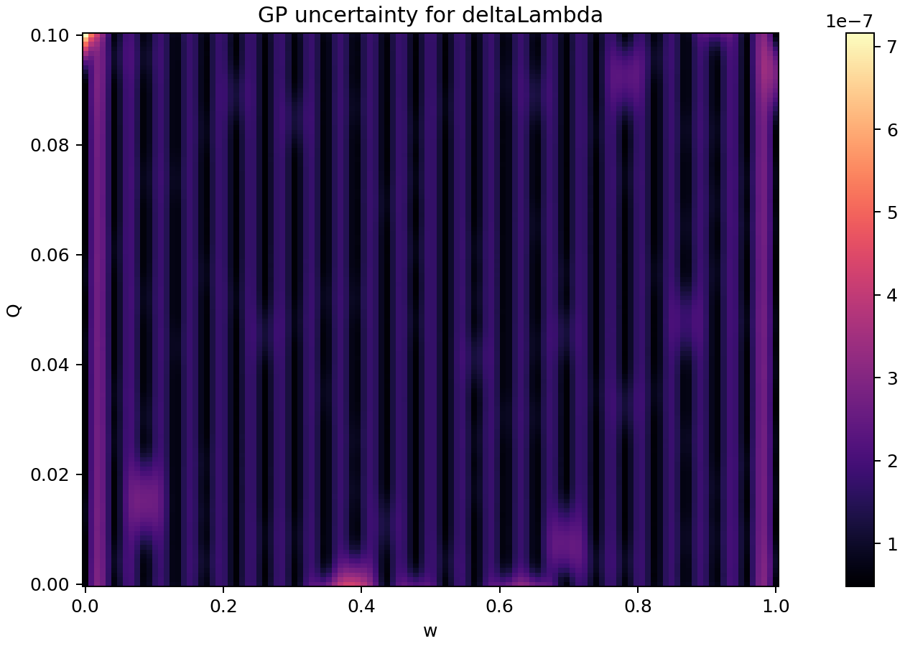

# QNM Gaussian Process Surrogate

Gaussian Process surrogate modelling for fast parameter search in black-hole
ringdown shifts.

This project implements the stronger two-output version of the idea:

```text
(w, Q) -> (deltaOmega, deltaLambda) -> omega_QNM
```

The code computes photon-sphere observables from a small fluid-inspired
perturbation of Schwarzschild, trains two uncertainty-aware Gaussian Process
models, and then uses the learned surrogate to infer the physical parameters
that reproduce a target complex quasinormal-mode frequency.

## Motivation

Ringdown observables can be expensive to evaluate if every point in parameter
space requires solving the full physical model. A surrogate model gives a fast
approximation while also estimating where it is uncertain.

Here the input parameters are:

- `w`: equation-of-state/profile parameter.
- `Q`: perturbation strength.

The learned targets are:

- `deltaOmega`: shift in photon-sphere orbital frequency.
- `deltaLambda`: shift in the Lyapunov exponent of the unstable null orbit.

Those are converted into the eikonal QNM estimate

```text
omega_QNM = ell * Omega_c - i * (n + 1/2) * lambda_c
```

where `Omega_c` is the circular null-orbit frequency, `lambda_c` is the
Lyapunov exponent, `ell` is the angular mode, and `n` is the overtone number.

## What the Script Does

1. Defines a perturbative black-hole metric model.
2. Solves the photon-sphere condition:

   ```text
   r A'(r) - 2 A(r) = 0
   ```

3. Computes `Omega_c`, `lambda_c`, and the complex eikonal QNM frequency.
4. Generates a grid dataset over `(w, Q)`.
5. Trains two Gaussian Process regressors:

   ```text
   GP_deltaOmega(w, Q)
   GP_deltaLambda(w, Q)
   ```

6. Produces prediction and uncertainty maps.
7. Performs inverse parameter search from a target QNM frequency.

## Repository Layout

```text
.
|-- qnm_surrogate.py          # Main physics + ML pipeline
|-- requirements.txt          # Python dependencies
|-- CITATION.cff              # Citation metadata for GitHub
|-- LICENSE                   # MIT license
|-- outputs/
|   |-- qnm_dataset.csv       # Generated training/evaluation grid
|   |-- gp_metrics.csv        # Test-set metrics
|   |-- parameter_search.csv  # Inverse QNM parameter recovery result
|   `-- *.png                 # Prediction and uncertainty maps
`-- README.md
```

## Quick Start

Create an environment and install dependencies:

```powershell
python -m venv .venv
.\.venv\Scripts\Activate.ps1
pip install -r requirements.txt
```

Run the full pipeline:

```powershell
python qnm_surrogate.py
```

The script regenerates the dataset, trains the GP models, runs parameter
recovery, and writes all outputs to `outputs/`.

## Example Results

Current test-set metrics:

| Target | RMSE | MAE | R2 | Mean GP sigma |
| --- | ---: | ---: | ---: | ---: |
| `deltaOmega` | `9.57e-08` | `1.92e-08` | `0.9999999998` | `1.26e-07` |
| `deltaLambda` | `1.02e-07` | `1.97e-08` | `0.9999999998` | `1.15e-07` |

Inverse search example:

| Quantity | Value |
| --- | ---: |
| Target `w` | `0.630000` |
| Target `Q` | `0.072000` |
| Recovered `w` | `0.630000` |
| Recovered `Q` | `0.072000` |
| Target `Re(omega)` | `0.420320` |
| Target `Im(omega)` | `-0.104041` |

## Figures

### GP Prediction for `deltaOmega`



### GP Uncertainty for `deltaOmega`



### GP Prediction for `deltaLambda`



### GP Uncertainty for `deltaLambda`



## Scientific Status

This is a research-prototype pipeline. The machine-learning and QNM workflow is
real, but the default metric perturbation in `metric_A` is intentionally a toy
model. It is designed to be easy to replace with the exact perturbative metric
functions from the paper or from a symbolic/numerical solver.

The important reusable structure is:

```text
metric model -> photon sphere -> Omega/lambda -> QNM -> GP surrogate -> inverse search
```

## How to Connect It to the Paper

Replace the implementation of `metric_A` and, if needed, `metric_B` in
`qnm_surrogate.py` with the metric functions from the theoretical model. The
rest of the pipeline can remain almost unchanged:

1. solve the circular null-orbit condition;
2. compute `Omega_c`;
3. compute `lambda_c`;
4. train one GP for `deltaOmega`;
5. train one GP for `deltaLambda`;
6. infer `(w, Q)` from a target complex QNM.

## Next Improvements

- Replace the toy perturbation with the exact metric from the paper.
- Add active learning: start with a small training set, then sample where GP
  uncertainty is largest.
- Add cross-validation across different grid resolutions.
- Save trained models with `joblib`.
- Add a notebook version for presentation and plots.

## License

MIT License. See `LICENSE`.
